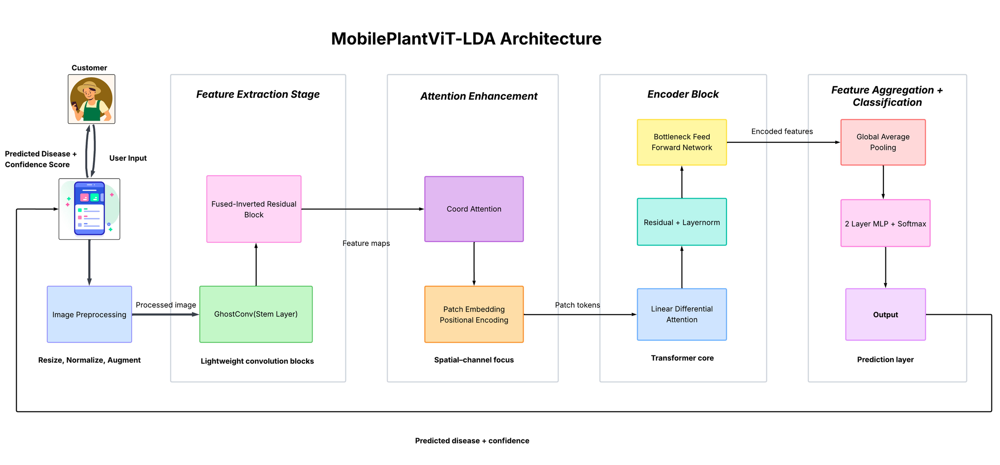
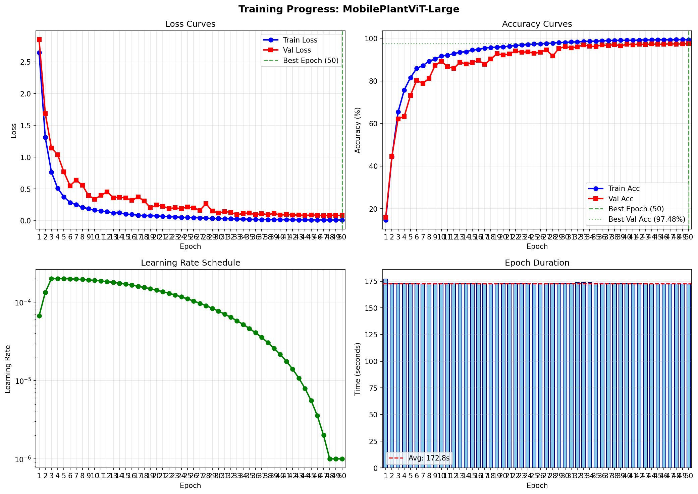
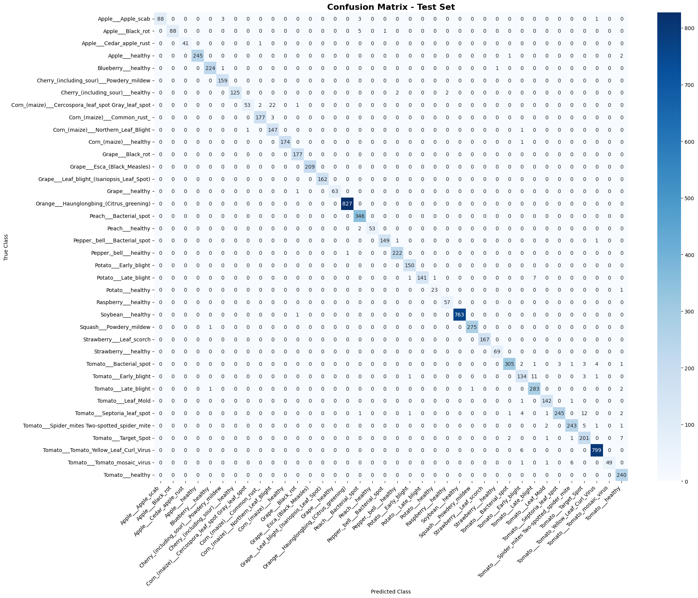

# MobilePlantViT-LDA: A Lightweight Hybrid CNN-Transformer Model for Plant Leaf Disease Detection 🌿

A Lightweight Hybrid CNN-Transformer Architecture for Plant Disease Classification featuring **Linear Differential Attention (LDA)**.

[](./MobilePlantViT-LDA.pdf)


[](https://pytorch.org/)
[]()
[]()

---

## 📄 Publication

This work was published in:

**6th International Conference on Computer Networks and Inventive Communication Technologies (ICCNCT 2026), IEEE**

Paper title:  
*MobilePlantViT-LDA: A Lightweight Hybrid CNN-Transformer Model for Plant Leaf Disease Detection*

DOI: *To be updated after IEEE Xplore indexing*

---

## 📖 Overview

**MobilePlantViT-LDA** is a novel, mobile-first deep learning architecture designed for highly accurate and efficient plant disease classification on edge devices. It seamlessly combines the local feature generation efficiency of CNNs (via Ghost Convolutions) with the global context understanding of Vision Transformers (ViT). 

The standout contribution of this architecture is the **Linear Differential Attention (LDA)** mechanism, which computes the difference between two attention maps to cancel out background noise (like background soil or shadows) and highlight meaningful disease patterns.

### ✨ Key Contributions

- **Hybrid Architecture**: Combines efficient CNN backbone with transformer attention.
- **Linear Differential Attention (LDA)**: Integrates Linear Differential Attention (LDA) into a lightweight hybrid CNN-Transformer architecture for efficient plant disease classification.
- **Mobile-First Efficiency**: Achieves high classification accuracy with low parameter (< 5M) count and fast inference suitable for mobile deployment.
- **Multiple Variants**: Tiny (~220K), Small (~490K), Base (~867K), and Large (~1.9M) parameter configurations.
- **Robust Preprocessing Pipeline**: Advanced dataset harmonization, pHash-based duplicate removal, and class-imbalance correction (Weighted Sampling/oversampling).
- **Comprehensive Pipeline**: End-to-end training, evaluation, and deployment workflow.

---

## 🏗️ Architecture



The network is composed of three primary stages:
1. **Feature Extraction (CNN Stage)**: Utilizes **GhostConv** stem layers for cheap feature generation, followed by **Fused-Inverted Residual Blocks** and **Coordinate Attention** to capture precise spatial and channel-wise positional information.
2. **Transformer Core (Attention Stage)**: Patches are passed into the **Linear Differential Attention** block. Unlike standard self-attention, LDA computes: `A_diff = α × (softmax(Q₁K₁ᵀ) - softmax(Q₂K₂ᵀ))`, canceling irrelevant noise. This is followed by a stateless **Residual LayerNorm** and a **Bottleneck Feed-Forward Network**.
3. **Classification Head**: Applies **Global Average Pooling (GAP)** over the sequence dimension, followed by a 2-layer MLP classification head outputting probabilities for 38 disease classes.

---

## 📊 Performance & Results

MobilePlantViT-LDA was trained and evaluated on the PlantVillage dataset (38 classes). The model significantly outperforms traditional mobile architectures.

### MobilePlantViT-Large vs MobileNetV2
| Metric | MobilePlantViT-Large | MobileNetV2 | Improvement |
|--------|-----------------------|-------------|-------------|
| **Accuracy (Top-1)** | **~97.48%** | ~96.00% | ✅ +1.48% |
| **Parameters** | **1.94M** | 3.54M | ✅ 45% Smaller |
| **Inference Latency** | **1.05 ms** | 8.50 ms | ✅ 8x Faster |

### Training Progress & Evaluation
The model employs Automatic Mixed Precision (AMP), Cosine Annealing, and heavy augmentations (ColorJitter, RandomAffine, RandomPerspective). 

<div align="center">
  
  
</div>

---

## 🔁 Reproducibility

The experiments were conducted under the following configuration:

| Component | Details |
|---|---|
| Random Seed | 42 |
| Framework | PyTorch 2.6.0 + CUDA 12.4 |
| GPU | Tesla P100-PCIE-16GB |
| Dataset | PlantVillage (49,370 refined images) |
| Input Resolution | 224 × 224 |
| Optimizer | AdamW |
| Initial Learning Rate | 2e-4 |

---

## 🗂️ Project Structure

```text
MobilePlantViT-LDA/
├── src/
│   ├── __init__.py
│   ├── blocks/                    # Neural network building blocks
│   │   ├── __init__.py
│   │   ├── attention.py           # Linear Differential Attention
│   │   ├── classifier.py          # GAP and Classification Head
│   │   ├── coord_attention.py     # Coordinate Attention module
│   │   ├── ffn.py                 # Bottleneck Feed-Forward Network
│   │   ├── fused_ir.py            # Fused Inverted Residual Block
│   │   ├── ghost_conv.py          # Ghost Convolution
│   │   ├── patch_embed.py         # Patch Embedding
│   │   ├── positional_encoding.py # Sinusoidal Positional Encoding
│   │   └── utils.py               # Utility functions
│   └── models/
│       ├── __init__.py
│       └── mobile_plant_vit.py    # Main model implementation
├── preprocessing/
│   └── preprocessing_color.ipynb  # Data preprocessing pipeline
├── training/
│   └── training-color-mobileplantvit-large.ipynb  # Training notebook
├── README.md                      # Project Documentation
└── MobilePlantViT-LDA.pdf         # Final Published Research Paper
```

---

## 💻 Installation & Quick Start

### Prerequisites
- Python 3.8+
- PyTorch 2.0+
- CUDA-enabled GPU (Highly Recommended for training)

### Setup
```bash
# Clone the repository
git clone https://github.com/SCSBalaji/MobilePlantViT-LDA.git
cd MobilePlantViT-LDA

# Install required dependencies
pip install torch torchvision numpy matplotlib pillow tqdm
```

### Running Inference
```python
import torch
from src.models import mobileplant_vit_large

# 1. Initialize the model (38 classes for PlantVillage)
model = mobileplant_vit_large(num_classes=38)

# 2. Load trained weights (Ensure weights are downloaded to the root)
weights_path = "MobilePlantViT-Large_best.pth"
model.load_state_dict(torch.load(weights_path, map_location="cpu"))
model.eval()

# 3. Perform inference
dummy_input = torch.randn(1, 3, 224, 224) # Standard input size
with torch.no_grad():
    logits = model(dummy_input)
    predictions = torch.nn.functional.softmax(logits, dim=1)
    
print(f"Predicted class index: {torch.argmax(predictions).item()}")
```

### Custom Configuration

```python
from src.models import MobilePlantViT, MobilePlantViTConfig

config = MobilePlantViTConfig(
    img_size=224,
    num_classes=38,
    ghost_out_channels=64,
    fused_ir_out_channels=64,
    embed_dim=256,
    num_heads=8,
    lda_dropout=0.1,
    ffn_bottleneck_ratio=0.25,
)

model = MobilePlantViT(config)
print(f"Parameters: {model.count_parameters():,}")
```

---

## ⚙️ Model Variants

MobilePlantViT is highly configurable to suit different hardware constraints:

| Variant | Parameters | Embed Dim | Heads | Target Hardware |
|---------|------------|-----------|-------|-----------------|
| **Tiny** | ~220K | 128 | 4 | Extreme Edge, IoT (Microcontrollers) |
| **Small** | ~490K | 192 | 6 | Standard Mobile Devices |
| **Base** | ~867K | 256 | 8 | High-End Mobile, Default Choice |
| **Large**| **1.94M** | 384 | 12 | Server / Desktop (Best Accuracy) |

---

## 📦 Building Blocks

### GhostConv
Efficient convolution using ghost features to reduce computation:
```python
from src.blocks import GhostConv
ghost = GhostConv(inp=64, oup=128, kernel_size=1, ratio=2)
```

### Coordinate Attention
Position-aware channel attention mechanism:
```python
from src.blocks import CoordAtt
coord_att = CoordAtt(inp=64, oup=64, reduction=32)
```

### Linear Differential Attention
The core attention mechanism:
```python
from src.blocks import LinearDifferentialAttention
lda = LinearDifferentialAttention(embed_dim=256, num_heads=8, dropout=0.1)
```

---

## 🔧 Training

### Data Preprocessing
The preprocessing pipeline handles:
- Dataset verification and corruption detection
- Duplicate image detection using perceptual hashing
- Class name harmonization
- Train/Val/Test splitting (70/15/15)
- Class imbalance analysis

Run the preprocessing notebook:
```bash
jupyter notebook preprocessing/preprocessing_color.ipynb
```

### Training Pipeline
The training notebook includes:
- Data augmentation (rotation, flip, color jitter, perspective)
- Mixed precision training (AMP)
- Cosine warmup learning rate schedule
- Gradient clipping for transformer stability
- Early stopping
- Comprehensive logging and visualization

Key training configurations:
```python
TRAINING_CONFIG = {
    'num_epochs': 50,
    'batch_size': 64,
    'optimizer': 'adamw',
    'learning_rate': 2e-4,
    'weight_decay': 0.01,
    'scheduler': 'cosine_warmup',
    'warmup_epochs': 3,
    'gradient_clip_max_norm': 1.0,
    'use_mixed_precision': True,
}
```

---

## 🚀 Web Application (Coming Soon)

A complete full-stack web application is currently under development to integrate this model into a real-world user interface. 

- **Frontend**: React-based scanner for farmers to upload leaf images.
- **Backend**: Node.js/Express server handling inference and user authentication.
- **Live Demo**: `[Link to be added upon deployment]`

*The project-interface folder will be pushed to this repository shortly after final tweaks and successful cloud deployment.*

---

## 🔬 Technical Details

### Attention Mechanism
The Linear Differential Attention computes:
1. Project input to Q₁, Q₂, K₁, K₂, V
2. Compute attention scores: `A₁ = softmax(Q₁K₁ᵀ/√d)`, `A₂ = softmax(Q₂K₂ᵀ/√d)`
3. Differential attention: `A_diff = α × (A₁ - A₂)`
4. Apply to values: `output = A_diff × V`

### Parameter Efficiency
The architecture achieves parameter efficiency through:
- **GhostConv**: Generates features cheaply via depthwise operations.
- **Bottleneck FFN**: Contracts then expands (opposite of standard transformer).
- **Single Transformer Block**: Minimal transformer overhead.
- **Efficient Projections**: Careful dimensionality choices.

---

## 📜 Citation

If you find this code or our architecture useful in your research, please consider citing our paper:

```bibtex
@inproceedings{mobileplantvit_lda2026,
  author = {M. Deepika and 
            Vaishnavi Abbanaboina and 
            Sangineedi Chaitanya Satya Balaji and 
            Gangisetti Himasree and 
            Astha Kumari and 
            Sreeja Vaitla},
  title = {MobilePlantViT-LDA: A Lightweight Hybrid CNN-Transformer Model for Plant Leaf Disease Detection},
  booktitle = {Proceedings of the 6th International Conference on Computer Networks and Inventive Communication Technologies (ICCNCT)},
  year = {2026},
  publisher = {IEEE},
  isbn = {979-8-3315-9019-2}
}
```

---

## 📚 References

- [GhostNet: More Features from Cheap Operations](https://arxiv.org/abs/1911.11907)
- [Coordinate Attention for Efficient Mobile Network Design](https://arxiv.org/abs/2103.02907)
- [EfficientNetV2: Smaller Models and Faster Training](https://arxiv.org/abs/2104.00298)
- [DIFF Transformer](https://arxiv.org/abs/2410.05258)
- [An Image is Worth 16x16 Words (ViT)](https://arxiv.org/abs/2010.11929)

---

## 📄 License & Acknowledgements

* Licensed under the MIT License.
* Dataset provided by [PlantVillage Dataset](https://www.kaggle.com/datasets/abdallahalidev/plantvillage-dataset). 
* Inspired by innovations in EfficientNet, GhostNet, and DIFF Transformer frameworks.

---

## 🤝 Contributing

Contributions are welcome! Please feel free to submit a Pull Request.

1. Fork the repository
2. Create your feature branch (`git checkout -b feature/AmazingFeature`)
3. Commit your changes (`git commit -m 'Add some AmazingFeature'`)
4. Push to the branch (`git push origin feature/AmazingFeature`)
5. Open a Pull Request

---

## 👥 Contributors

This project was collaboratively developed by the following contributors:

| Name | GitHub |
|---|---|
| **Sangineedi Chaitanya Satya Balaji** | [@SCSBalaji](https://github.com/SCSBalaji) |
| **Vaishnavi Abbanaboina** | [@username](https://github.com/vaishnavi-2105) |
| **Gangisetti Himasree** | [@username](https://github.com/Celestia2006) |
| **Astha Kumari** | [@username](https://github.com/Asthakumari009) |
| **Sreeja Vaitla** | [@username](https://github.com/SreejaVaitla) |

---

## 📧 Contact

For questions or feedback, please open an issue on GitHub.

---

## ⭐ Acknowledgments

- PlantVillage dataset for providing the plant disease images.
- The PyTorch team for the excellent deep learning framework.
- The research community for the foundational architectures and techniques.
